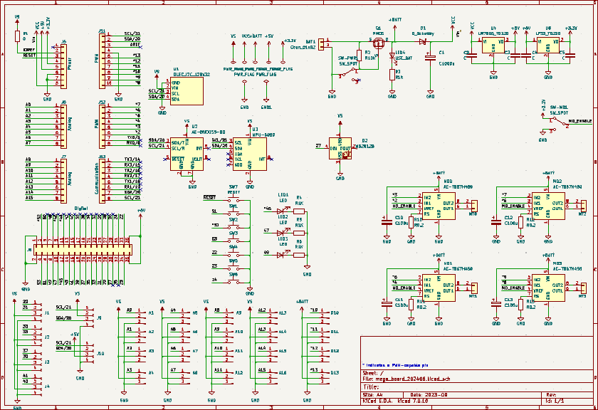
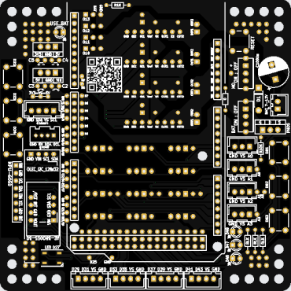
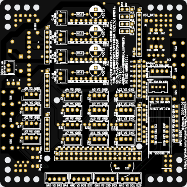

# Arduino Mega 拡張基板 2024年版

## 概要

+ Arduino Mega をXHコネクタで使うための基板の2024年版。
  + [2023版](https://github.com/ohguma/mega_board2023/)との違い。
    + リニアレギュレータ用パターンの変更、ベタグランド対応
    + grove端子対応 I2C,UART
    + NeoPixcel LED 1個 [ D27 ]
+ [Mega 2560 Rev3](https://docs.arduino.cc/hardware/mega-2560), [Due](https://docs.arduino.cc/hardware/due) で利用可能。[GIGA R1 WiFi](https://docs.arduino.cc/hardware/giga-r1-wifi)もDueと同様に利用できるはずだが未検証。
+ 下記の利用も可能。
  + 4ピンXHで［ D29,D31 ］［ D33,D35 ］［ D37,D39 ］［ D41,D43 ］
  + 他のデジタルピンもビアから接続可能。
  + 6つのタクトスイッチ（D22, D23, D24, D51, D52, D53）INPUT_PULLUP で使う。
  + 3つのLED（D45, D47, D49）HIGHで点灯。
  + サーボ用端子（D10～D13）
  + 複数のI2C端子。全て D20/SDA, D21/SCL に並列で接続。
    + TJ3B互換［SCL, 5V, SDA, GND］配置を1ポート、grove [ SCL, SDA, 5V, GND] 配置を1ポート
    + MPU6050用　GY-BNO055も可能
    + [AE-BNO055-BO](https://akizukidenshi.com/catalog/g/gK-16996)
    + OLED(128x32)
+ モータードライバTB67H450FNG搭載のモジュール「[AE-TB67H450](https://akizukidenshi.com/catalog/g/gK-14753/)」を最大４個搭載可能。
  + [TB67H450FNG日本語データシート](https://toshiba.semicon-storage.com/info/TB67H450FNG_datasheet_ja_20201126.pdf?did=65345&prodName=TB67H450FNG)
  + 各INA, INB　1ch：D2,D3　2ch：D4,D5　3ch：D6,D7　4ch：D8,D9
  + 全モータードライバ出力の有効/無効の切替トグルスイッチ
+ 基板サイズ　98 x 98mm、周囲の穴は3.2mm径、5mm間隔
  + [タミヤ ユニバーサルプレート](https://www.tamiya.com/japan/products/70172/index.html)上に取り付け可能。

### Mega 2560 Rev3, Due, GIGA R1 WiFi の違い

+ [Mega 2560 Rev3](https://docs.arduino.cc/hardware/mega-2560)
+ [Due](https://docs.arduino.cc/hardware/due)
+ [GIGA R1 WiFi](https://docs.arduino.cc/hardware/giga-r1-wifi)

| TH | Mega | Due | GIGA |
| ---- | ---- | ---- | ---- |
| CPU | ATmega2560 | AT91SAM3X8E | STM32H747XI |
| クロック速度 | 16 MHz | 84MHz | 主コア 480MHz 副コア 240MHz |
| メモリ | 8KB SRAM 256KB flash | 96KB SRAM 512KB flash | 1MB RAM 2MB Flash |
| USBコネクタ | USB-B | micro USB | USB-C |
| VIN | 7～12V | 7～12V | 6～24V |
| デジタル入出力 | 54 | 54 | 76 |
| アナログ入力 | 16 | 12 | 12 |
| アナログ出力(DAC) | 0 | 2 | 2 |
| PWM出力 | 15 | 12 | 12 |
| 動作電圧 | 5V | 3.3V | 3.3V |
| 1 I/Oピンの最大出力電流 | 20mA | 9mA or 3mA | 8mA |
| 全I/Oピンの合計最大出力電流 | ※ | 130mA | -- |

+ [ATmega2560](https://www.microchip.com/en-us/product/atmega2560)　[データシート](https://ww1.microchip.com/downloads/aemDocuments/documents/OTH/ProductDocuments/DataSheets/ATmega640-1280-1281-2560-2561-Datasheet-DS40002211A.pdf)
  + ※ ATmega2560単体では分散して最大800mA 
  + 「31.Electrical Characteristics」の Notes 3, 4
+ [AT91SAM3X8E](https://www.microchip.com/en-us/product/atsam3x8e) 　[データシート](https://ww1.microchip.com/downloads/en/DeviceDoc/Atmel-11057-32-bit-Cortex-M3-Microcontroller-SAM3X-SAM3A_Datasheet.pdf)
  + 「45. Electrical Characteristics」
  + 144-lead LQFP 130mA
+ [STM32H747XI](https://www.st.com/ja/microcontrollers-microprocessors/stm32h747xi.html)　 [データシート](https://www.st.com/resource/en/datasheet/stm32h747xi.pdf)
  + 「6 Electrical characteristics」「6.2 Absolute maximum ratings」
  + ΣI(PIN)　140mA

## サンプルなど

旧版のものが基本そのまま使える。
+ [旧版](https://github.com/ohguma/mega_board/)
  + [サンプル](https://github.com/ohguma/mega_board/tree/main/sample/)  
  + [課題](https://github.com/ohguma/mega_board/tree/main/lesson)

## マニュアル
+ PDF準備中

## 実装例
+ 準備中

### パーツリスト

個数は明記なければ1個。

+ Arduino の Mega2560 R3、もしくは Due、もしくは GIGA R1 WiFi 、もしくはそれらの互換機
+ ピンヘッダ
  - 1x8　5個
  - 1x10　10個
  - 2x18　18個
  - 1x3　最大4個。サーボ使用時
+ 入出力関係
  - LED 45,47,49用 3mmLED。色をバラしておくと確認が容易になる。
  - 上記LED用電流制限抵抗 1KΩ（茶黒赤金　LED Vf=2[V] 、Megaで3mA想定）
  - [秋月　マイコン内蔵RGBLED WS2812B](https://akizukidenshi.com/catalog/g/g107915/)
  - タクトスイッチ　制御用　最大6個
  - タクトスイッチ　リセット用　1個
  - 以下任意。
    - [秋月　ＢＮＯ０５５使用　９軸センサーフュージョンモジュールキット AE-BNO055-BO](https://akizukidenshi.com/catalog/g/gK-16996)
      - VIN、GND、SDA/T、SCL/Rを接続する。
    - ジャイロセンサMPU-6050
      - amazon などでMPU6050(GY-521)として売られているもの。
      - VCC、GND、SCL、SDAの4ピンを接続する。 
      - GY-BNO055なども接続できる。
    - OLED 128x32 I2C
      - 上記のセンサに被さるように配置するのでピンソケット等適宜使用
      - Adafruit SSD1306 ライブラリを利用する。
+ モータードライバ関係
  - 最大4セット
  - [秋月　ＴＢ６７Ｈ４５０モータドライバモジュール AE-TB67H450](https://akizukidenshi.com/catalog/g/gK-14753/)
    - [マルツ　ブラシ付きDCモータードライバーIC DIP化基板(TB67H450FNG)](https://www.marutsu.co.jp/pc/i/1559301/)も同じピン配置なので利用できると思われる。
  - [金属皮膜抵抗 1W 0.2Ω](https://akizukidenshi.com/catalog/g/gR-08799/)　　電流制限用。抵抗値の選定はTB67H450FNGデータシート参照のこと。
  - 電解コンデンサ 50V 100uF モジュールごとに1個（耐圧は利用外部電源に合わせること）
  - モータードライバ用トグルスイッチ 1個（TB67H450FNGのVREFに接続。ON時は3.3V、OFF時はGNDに接続）
+ 電源関連 各1個
  - 基板用トグルスイッチ（下記FETのON/OFF用）
  - Pch-MOSFET（30V40A MTP4835I3等）
  - 抵抗 10KΩ（茶黒橙金）
  - 0Ω抵抗。内蔵レギュレータ使用時に接続。別途レギュレータを使う場合は接続しない。
  - ショットキーダイオード （40V1A 1S4など。Mega VINの逆接防止用）
  - 電解コンデンサ 10V 1000uF等（モーター動作時などの電圧降下対策用。耐圧は利用外部電源に合わせること）
  - 電源ON表示用3mmLED
  - 上記LED用電流制限抵抗 1KΩ（茶黒赤金　外部電源7.2[V] LED Vf=2[V] 5mA想定）
+ センサ系電源まわり
  + 内蔵レギュレータを使用しない場合に使用する。5V用は必須。ドロップアウト電圧が低いものを使う。
  - 5Vレギュレータ（5V1A [TA4805S](https://akizukidenshi.com/catalog/g/gI-00537/)等）
  - 3.3Vレギュレータ（5V1A [TA48033S](https://akizukidenshi.com/catalog/g/gI-00534/)等）
    - 3.3Vレギュレータ入力端子は5Vレギュレータ出力端子に接続している。 

 
## 購入先

+ パーツは[秋月電子](https://akizukidenshi.com/catalog/)で概ね揃う。
+ 2024年6月25日時点、Due は[アスクル](https://www.askul.co.jp/p/PU81727/)が安い。（ピンヘッダありで4,446円）

## 回路図

- モータードライバ周りはアプリケーションノートに従った。
  - [TB67H450FNGアプリケーションノート](https://akizukidenshi.com/download/ds/toshiba/TB67H450FNG_application_note_ja_20190510.pdf)
- Mega, Due の内蔵レギュレータからセンサポートに電源供給する場合、メインスイッチ横の0Ω抵抗を接続する。そうすることで、センサポート電源が IOREF に接続され、Mega の場合は5V、Dueの場合は3.3Vが供給される。
- 内蔵レギュレータを使用しない場合は0Ω抵抗は接続しない。センサポート電源を5Vにする場合は5Vレギュレータを、3.3Vにする場合は追加で3.3Vレギュレータも接続し、同じ箇所にある「3V3 - () - 5V」の箇所をジャンパする。

## 基板作成

+ [KiCAD7](https://www.kicad.org/)で設計し、基板作成まで行った。
  + コネクタは表・裏どちらにも実装し易いよう、フットプリントで両面にシルクを入れた。
  + センサ用ポートはXHコネクタ3ピン想定だが、4ピンのXHもしくはgroveコネクタも使えるようにした。
  + 参考書　 「[KiCad 7 入門実習テキスト『KiCad Basics for 7.0』（ダウンロード商品）](https://booth.pm/ja/items/4560998)」
+ 基板作成は「[JLCPCB](https://jlcpcb.com/)」を利用した。
  + つや消し黒が安い。
  + 2024-06-19発注、2024-06-XX到着運。送便はOCS Expressを選択
  + twitter https://twitter.com/JLCPCB_Japan
+ [発注時ガーバーファイル](./pcb/mega_board_202406.zip)

## 関連3Dプリントデータ
+ [Arduino Mega 底面ホルダ](./cad/mega_bottom.stl)　※ホルダが付属しない互換機などでの利用を想定。

----

2024-06-25 ohguma 初版